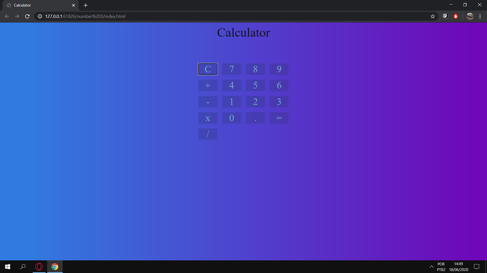

# Calculator

- [x] Add Function.
- [x] Subtraction Function.
- [x] Divide Function.
- [x] Multiplication Function.
- [x] Clean Function.

## Description
- Just some simple calculator that i did to learn JS.
- I'm add some CSS style for better viewing.
- Hope you have fun looking this.

## :runner: To run this project ?

You needs load the project files in a web server, use [Live Server](https://marketplace.visualstudio.com/items?itemName=ritwickdey.LiveServer) for this.

## Just a spoiler

